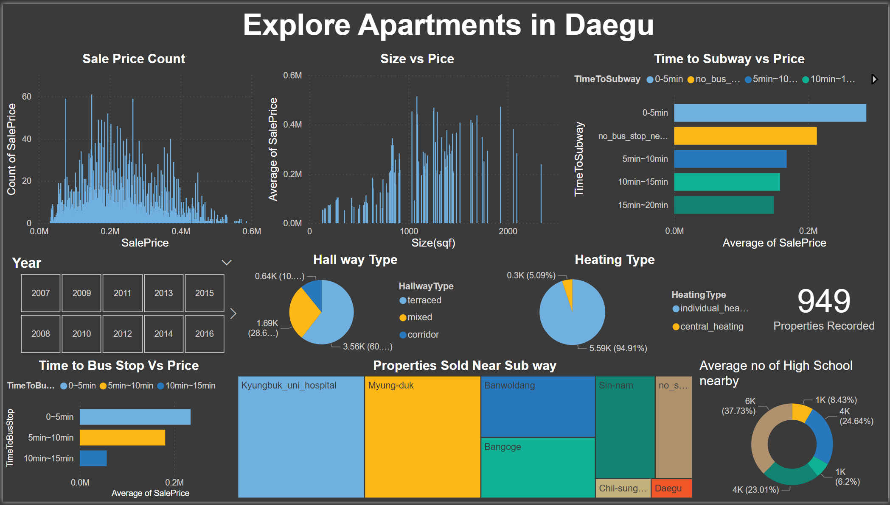

# 🏢 Daegu Apartments Analysis Dashboard

## 🎯 Overview

Welcome to the Daegu Apartments Analysis project! This Power BI dashboard provides comprehensive insights into the real estate market in Daegu, South Korea. Through detailed visualization and analysis of various property attributes, we aim to help understand property pricing factors and market trends in this vibrant city.

## 🔑 Key Features

- 📊 Property Price Distribution Analysis
- 🏗️ Size vs. Price Correlation
- 🚇 Transit Accessibility Impact
- 🏫 Educational Facility Proximity
- 🔄 Interactive Year-based Filtering

## 📚 Dataset Description

The dataset is sourced from the UCI Machine Learning Repository and includes detailed information about apartments in Daegu, South Korea. 

### 📋 Key Metrics

- 💰 Sale Price
- 📏 Size in Square Feet
- 🚇 Time to Subway/Bus Stop
- 🏫 Number of Schools Nearby
- 🏢 Building Characteristics
  - Hallway Type
  - Heating System
  - Management Type
  - Parking Facilities

### ⌛ Time Coverage
- Multiple years of property sales data
- Comprehensive property attributes
- Location-specific measurements

## 📊 Dashboard Components

### 1. Property Price Analysis
- Distribution of sale prices
- Price trends over years
- Size-price correlation analysis

### 2. Location Benefits
- Time to subway analysis
  - 0-5 minutes: Premium properties
  - 5-10 minutes: Mid-range
  - 10-15 minutes: Value properties
- Bus stop proximity impact
- Subway station popularity trends

### 3. Building Features
- Hallway Types Distribution
  - 60% Terraced
  - 29% Mixed
  - 11% Corridor
- Heating Systems
  - 95% Individual Heating
  - 5% Central Heating

### 4. Educational Access
- High school proximity analysis
- School district mapping
- Educational facility distribution

## 🔍 Key Insights

1. **Transit Premium**
   - Properties within 0-5 minutes of subway stations command highest prices
   - Clear correlation between transit accessibility and property values

2. **Size-Price Relationship**
   - Positive correlation between apartment size and price
   - Price per square foot varies by location

3. **Building Features**
   - Strong preference for individual heating systems
   - Terraced hallways are most common

4. **Educational Access**
   - 33% of properties have ~5 high schools nearby
   - School proximity impacts property desirability

## 🛠️ Technical Implementation

### 🎚️ Interactive Features
- Year-based filtering (2007-2016)
- Property count tracking
- Dynamic price range analysis
- Location-based filtering

### 📊 Visualization Types
1. Histograms for price distribution
2. Scatter plots for size-price correlation
3. Bar charts for transit accessibility
4. Pie charts for building features
5. Tree maps for subway station analysis
6. Donut charts for school proximity

## 🚀 Getting Started

1. Install Power BI Desktop
2. Download the dataset from UCI Repository
3. Load the .pbix file
4. Explore the interactive dashboard

## 📈 Future Improvements

1. 📅 Add seasonal price trend analysis
2. 🗺️ Integrate geographical mapping
3. 📊 Add more demographic indicators
4. 🔮 Implement price prediction models

## 🙏 Acknowledgments

- UCI Machine Learning Repository
- Power BI Community
- Real Estate Data Contributors

## 📬 Contact & Support

For questions and support:
- 📧 Create an issue
- ⭐ Star the repository
- 🔄 Fork for your own use

---

Made with 💖 for better real estate market